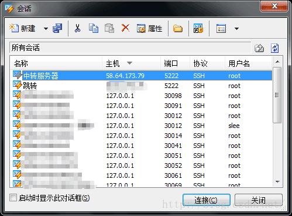
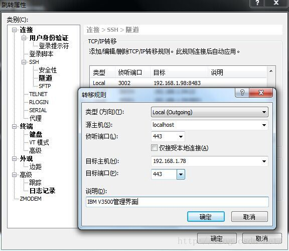

## Xshell 4 SSH隧道跳转访问局域网服务器

为什么要用ssh隧道？

1. 通过公网访问局域网中的服务器

2. 局域网中某些服务器或阵列提供Web管理界面，需要通过公网打开该管理界面

设想情景：我想在家用自己的浏览器打开公司局域网中的web服务器做coding，此时就需要将公司局域网中web服务器的端口映射到我自己的电脑的端口。

###### 前提：局域网中有某台服务器接了公网（双网口，一个WAN，一个LAN）

### 方法

1. 假设一台局域网中的中转服务器A：

公网IP：58.64.173.79

局域网IP：192.168.1.99

通过服务器A来配置ssh隧道，将远程局域网中的服务器各个应用端口映射到本机端口，然后通过本机IP和端口去访问局域网中的其他服务器端口。

2. 假设局域网中一台服务器B

局域网IP：192.168.1.78

服务器B配置了内部https端口443，我们可以将这个443端口映射到本机的某一个端口，然后在本机的这个端口打开https界面。

图一选中“中转服务器”这个session->右键->属性->隧道->添加->图二

打开浏览器，输入https://127.0.0.1:443(这个IP是本机IP，端口是图一中设置的本机 侦听端口，如果设置成其他的则改成相应的端口即可，等同于在局域网内登录https://192.168.1.78) 

### 参考资料

https://blog.csdn.net/jw2522/article/details/47065367

 
